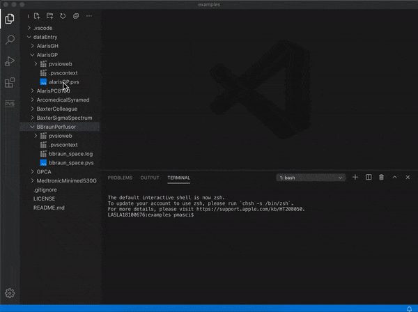

# PVSio-web Examples
This repository provides a collection of interactive simulations developed with PVSio-web. The visual front-end of each simulation builds on Web technologies (HTML, CSS, Javascript). Underneath, the the prototype is driven by an executable formal model developed in PVS.

The examples were develped within [CHI+MED](https://www.chi-med.ac.uk/), as part of a research effort on improving the safety of human-machine interfaces in medical devices.

 

## Running the simulations
To run the simulations, clone this repository and open the folders with the latest version of the Prototype Builder included in [VSCode-PVS](https://github.com/nasa/vscode-pvs).

 

  

## Get in touch
If you have questions regarding the simulations, or would like to contribute with new simulations, get in touch with us on the [PVS Google Group](https://groups.google.com/g/pvs-group)

 

## Additional Resources
More examples can be found at the following links:
- http://www.pvsioweb.org/